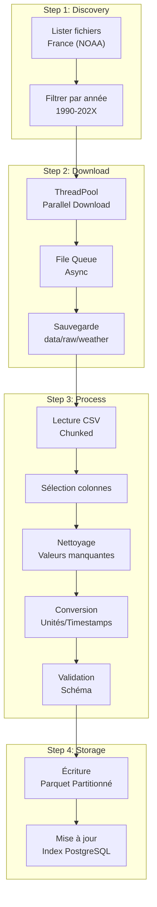
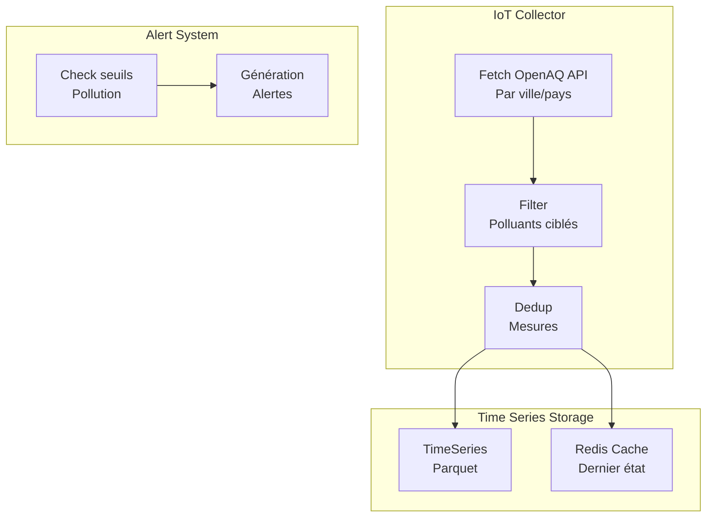
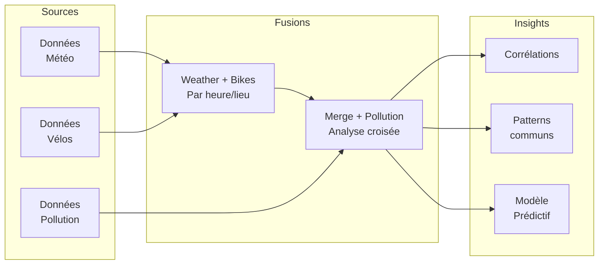
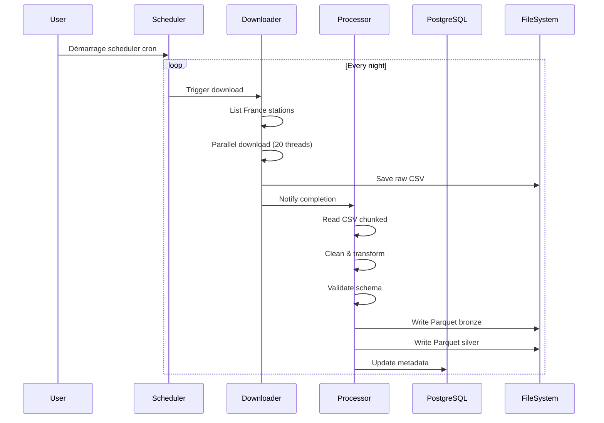
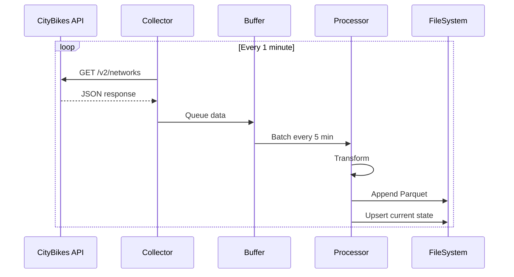
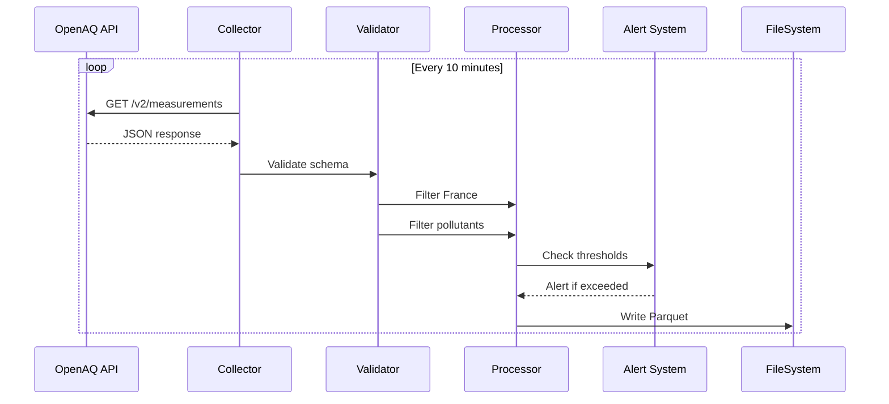
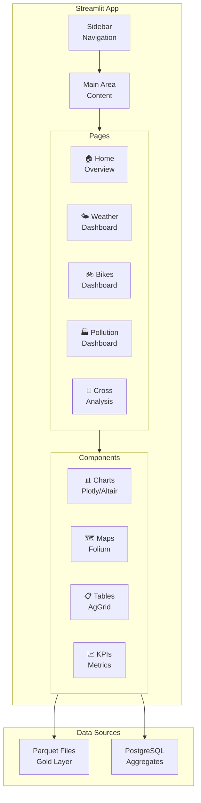

# UrbanHub - Spécification Technique Complète

## Table des Matières

1. [Vue d'Ensemble](#vue-densemble)
2. [Architecture Globale](#architecture-globale)
3. [Architecture des Données](#architecture-des-données)
4. [Partie 1 - Flux Batch : Données Météorologiques](#partie-1---flux-batch--données-météorologiques)
5. [Partie 2 - Flux Streaming : Mobilité Urbaine](#partie-2---flux-streaming--mobilité-urbaine)
6. [Partie 3 - Flux IoT : Pollution Urbaine](#partie-3---flux-iot--pollution-urbaine)
7. [Partie 4 - Analyse Croisée](#partie-4---analyse-croisée)
8. [Stack Technologique](#stack-technologique)
9. [Structure du Projet](#structure-du-projet)
10. [Pipeline de Traitement](#pipeline-de-traitement)
11. [Visualisation et Dashboard](#visualisation-et-dashboard)
12. [Livrables](#livrables)

---

## 1. Vue d'Ensemble

**UrbanHub** est une plateforme Smart City visant à ingérer, traiter et analyser les données urbaines provenant de trois sources distinctes :
- **Données météorologiques** (flux batch)
- **Données de mobilité bike-sharing** (flux streaming)
- **Données de pollution atmosphérique** (flux IoT)

L'objectif est de produire des indicateurs urbains exploitables par les décideurs publics.

### Objectifs Clés

| Objectif | Description |
|----------|-------------|
| Ingestion | Collecte automatique des 3 types de données |
| Stockage | Architecture Data Lake avec fichiers Parquet + PostgreSQL |
| Traitement | Nettoyage, transformation et enrichissement |
| Analyse | Réponses aux questions métier |
| Visualisation | Dashboards Streamlit |

---

## 2. Architecture Globale

```mermaid
flowchart TB
    subgraph Sources["Sources de Données"]
        NOAA["NOAA - Données Météo<br/>Global Hourly"]
        CityBikes["CityBikes API<br/>Vélos en libre-service"]
        OpenAQ["OpenAQ API<br/>Capteurs Pollution"]
    end

    subgraph Ingestion["Couche Ingestion"]
        DL_Batch["Download Batch<br/>Parallel HTTP"]
        API_Stream["API Streaming<br/>CityBikes"]
        API_IoT["API IoT<br/>OpenAQ"]
    end

    subgraph Storage["Couche Stockage"]
        Raw["Raw Data<br/>CSV/JSON"]
        Bronze["Bronze Layer<br/>Parquet"]
        Silver["Silver Layer<br/>Parquet Nettoyé"]
        Gold["Gold Layer<br/>Agrégats"]
        DB["PostgreSQL<br/>Métadonnées"]
    end

    subgraph Processing["Couche Traitement"]
        Clean["Nettoyage"]
        Transform["Transformation"]
        Enrich["Enrichissement"]
        Aggregate["Agrégation"]
    end

    subgraph Analysis["Couche Analyse"]
        EDA["Analyse Exploratoire"]
        Stats["Statistiques"]
        ML["Analyse Corrélation"]
    end

    subgraph Output["Couche Output"]
        Dash["Dashboard<br/>Streamlit"]
        API["API REST<br/>Indicateurs"]
    end

    Sources --> Ingestion
    Ingestion --> Storage
    Storage --> Processing
    Processing --> Analysis
    Analysis --> Output
```



---

## 3. Architecture des Données

```mermaid
flowchart LR
    subgraph "Data Lake Architecture"
        direction TB
        
        Raw["📁 /data/raw<br/>Données brutes<br/>CSV/JSON"]
        Bronze["📁 /data/bronze<br/>Parquet brut<br/>Partitionné"]
        Silver["📁 /data/silver<br/>Parquet nettoyé<br/>Typé"]
        Gold["📁 /data/gold<br/>Agrégations<br/>Par sujet]
        
        Raw --> Bronze
        Bronze --> Silver
        Silver --> Gold
    end
    
    subgraph "Base de données"
        PG["🗄️ PostgreSQL<br/>Métadonnées<br/>Index"]
    end
    
    Bronze --> PG
    Silver --> PG
    Gold --> PG
```

### Structure des Répertoires

```
urban_data/
├── data/
│   ├── raw/                    # Données brutes téléchargées
│   │   ├── weather/            # NOAA raw CSV
│   │   ├── bikes/              # CityBikes JSON
│   │   └── pollution/          # OpenAQ JSON
│   ├── bronze/                 # Parquet brut avec partition
│   │   ├── weather/
│   │   ├── bikes/
│   │   └── pollution/
│   ├── silver/                 # Parquet nettoyé et typé
│   │   ├── weather/
│   │   ├── bikes/
│   │   └── pollution/
│   └── gold/                   # Agrégations finales
│       ├── daily_weather/
│       ├── hourly_bikes/
│       ├── daily_pollution/
│       └── cross_analysis/
├── src/
│   ├── batch/                  # Scripts flux batch
│   ├── streaming/              # Scripts flux streaming
│   ├── iot/                    # Scripts flux IoT
│   ├── etl/                    # Scripts ETL communs
│   ├── analysis/               # Analyses exploratoires
│   ├── visualization/          # Dashboards Streamlit
│   └── utils/                  # Fonctions utilitaires
├── notebooks/                  # Jupyter notebooks
├── config/                     # Fichiers de configuration
├── docker/                     # Docker Compose
├── logs/                       # Logs d'exécution
└── docs/                       # Documentation
```

---

## 4. Partie 1 - Flux Batch : Données Météorologiques

### Source de Données

- **URL** : https://www.ncei.noaa.gov/data/global-hourly/access/
- **Données** : Observations météorologiques horaires mondiales
- **Période** : 1990 - Présent
- **Zone géographique** : Stations en France uniquement

### Variables à Extraire

| Variable | Description | Type |
|----------|-------------|------|
| `station_id` | Identifiant de station | String |
| `timestamp` | Date/heure observation | Datetime |
| `temperature` | Température (°C) | Float |
| `wind_speed` | Vitesse du vent (m/s) | Float |
| `wind_direction` | Direction du vent (degrés) | Float |
| `pressure` | Pression atmosphérique (hPa) | Float |
| `precipitation` | Précipitations (mm) | Float |
| `visibility` | Visibilité (m) | Float |

### Architecture du Pipeline Batch



### Logique de Téléchargement Parallèle

```python
# Pseudo-code :Téléchargement parallèle
# - Utilisation de concurrent.futures.ThreadPoolExecutor
# - 10-20 connexions simultanes max
# - Téléchargement par chunks pour gros fichiers
# - Retry automatique en cas d'échec
# - Rate limiting pour éviter le ban NOAA
```

### Questions Métier - Analyse

| # | Question | Analyse Requise |
|---|----------|-----------------|
| 1 | Périodes météorologiques anormales | Détection d'anomalies (Z-score, IQR) |
| 2 | Corrélation météo-visibilité | Coefficient de corrélation Pearson |
| 3 | Évolution saisonnière température | Séries temporelles, moyennes mobiles |
| 4 | Jours extrêmes | Identification jours max/min historique |

---

## 5. Partie 2 - Flux Streaming : Mobilité Urbaine

### Source de Données

- **URL** : https://api.citybik.es/v2/
- **Données** : Stations de vélos en libre-service temps réel
- **Fréquence** : Toutes les 1 minute
- **Zone** : Principales villes de France (Paris, Lyon, Marseille, Toulouse, Bordeaux, Nantes, etc.)

### Variables à Extraire

| Variable | Description | Type |
|----------|-------------|------|
| `station_id` | Identifiant unique station | String |
| `station_name` | Nom de la station | String |
| `latitude` | Latitude | Float |
| `longitude` | Longitude | Float |
| `bikes_available` | Nombre de vélos disponibles | Integer |
| `free_slots` | Nombre d'emplacements libres | Integer |
| `timestamp` | Date/heure capture | Datetime |

### Architecture du Pipeline Streaming

```mermaid
flowchart TB
    subgraph "Collector"
        API["Appel API<br/>CityBikes"]
        Parse["Parsing JSON"]
        Extract["Extraction<br/>champs"]
    end

    subgraph "Buffer"
        Buffer["Buffer en mémoire<br/>Queue"]
        Window["Fenêtre glissante<br/>5 min"]
    end

    subgraph "Storage"
        Append["Append to<br/>Parquet"]
        Update["Upsert<br/>État actuel"]
    end

    subgraph "Scheduler"
        Cron["Cron job<br/>1 minute"]
        Monitor["Monitoring<br/>Échecs"]
    end

    API --> Parse
    Parse --> Extract
    Extract --> Buffer
    Buffer --> Window
    Window --> Append
    Window --> Update
    Cron --> API
    Monitor --> Cron
```

### Logique de Collection

```python
# Pseudo-code : Collection streaming
# - Boucle infinie avec sleep(60)
# - Appel API GET /v2/networks?fields=stations
# - Parse réponse JSON
# - Extraction des champs requis
# - Écriture parquet append mode
# - Logging à chaque cycle
# - Gestion des erreurs avec retry
```

### Questions Métier - Analyse

| # | Question | Analyse Requise |
|---|----------|-----------------|
| 1 | Stations plus utilisées | Top 10 par taux rotation |
| 2 | Zones offre insuffisante | Stations frequently empty |
| 3 | Pics utilisation journaliers | Heatmap hourly usage |
| 4 | Déséquilibres géographiques | Carte disponibilité |
| 5 | Stations critiques | Alertes sous-seuil |

---

## 6. Partie 3 - Flux IoT : Pollution Urbaine

### Source de Données

- **URL** : https://api.openaq.org/v2/ (v3 aussi disponible)
- **Données** : Mesures capteurs pollution atmosphérique
- **Fréquence** : Toutes les 5-15 minutes (simulation)
- **Zone** : France, principales villes

### Polluants Ciblés

| Polluant | Description | Unité |
|----------|-------------|-------|
| PM2.5 | Particules fines < 2.5μm | μg/m³ |
| PM10 | Particules fines < 10μm | μg/m³ |
| O3 | Ozone | μg/m³ |
| NO2 | Dioxyde d'azote | μg/m³ |
| CO | Monoxyde de carbone | mg/m³ |

### Variables à Extraire

| Variable | Description | Type |
|----------|-------------|------|
| `sensor_id` | Identifiant du senseur | String |
| `latitude` | Latitude | Float |
| `longitude` | Longitude | Float |
| `pollutant` | Type de polluant | String |
| `value` | Valeur mesurée | Float |
| `unit` | Unité de mesure | String |
| `timestamp` | Date/heure mesure | Datetime |

### Architecture du Pipeline IoT



### Questions Métier - Analyse

| # | Question | Analyse Requise |
|---|----------|-----------------|
| 1 | Zones pollution élevée | Cartographie par ville |
| 2 | Variation journalière | Profil journalier moyen |
| 3 | Polluants dominants | Distribution par type |
| 4 | Épisodes anormaux | Détection pics pollution |

---

## 7. Partie 4 - Analyse Croisée

### Analyses Multi-Sources



### Questions Métier - Cross-Analysis

| # | Question | Approche |
|---|----------|----------|
| 1 | Relation météo-pollution | Corrélation Pearson/Spearman |
| 2 | Météo influence vélos | Regression multivariate |
| 3 | Conditions favorables vélotaf | Identification seuils |
| 4 | Périodes d'interaction forte | Analyse multi-variée |

---

## 8. Stack Technologique

### Langage et Environnements

| Catégorie | Technologie | Version |
|-----------|-------------|---------|
| Langage principal | Python | 3.11+ |
| Environment | Conda/Mamba | Latest |
| IDE | VS Code / PyCharm | - |

### Bibliothèques Python

#### Data Collection
| Package | Usage | Version |
|---------|-------|---------|
| `requests` | Appels HTTP | ^2.31 |
| `aiohttp` | Appels async | ^3.9 |
| `httpx` | Client HTTP async | ^0.25 |
| `beautifulsoup4` | Scraping HTML | ^4.12 |

#### Data Processing
| Package | Usage | Version |
|---------|-------|---------|
| `pandas` | Manipulation données | ^2.1 |
| `polars` | Alternative rapide | ^0.20 |
| `pyarrow` | Format Parquet | ^14.0 |
| `pyarrow.parquet` | Lecture/écriture | - |
| `numpy` | Calculs numériques | ^1.26 |

#### Data Storage
| Package | Usage | Version |
|---------|-------|---------|
| `sqlalchemy` | ORM PostgreSQL | ^2.0 |
| `psycopg2-binary` | Driver PostgreSQL | ^2.9 |
| `redis` | Cache | ^5.0 |

#### Orchestration
| Package | Usage | Version |
|---------|-------|---------|
| `schedule` | Planification scripts | ^1.2 |
| `python-cron` | Cron jobs | - |
| `apscheduler` | Advanced scheduling | ^3.10 |

#### Visualization
| Package | Usage | Version |
|---------|-------|---------|
| `streamlit` | Dashboard | ^1.29 |
| `plotly` | Graphes interactifs | ^5.18 |
| `altair` | Visualisation Vega-Lite | ^5.1 |
| `folium` | Cartes interactives | ^0.15 |

#### Utils
| Package | Usage | Version |
|---------|-------|---------|
| `python-dotenv` | Variables environnement | ^1.0 |
| `pydantic` | Validation données | ^2.5 |
| `loguru` | Logging | ^3.10 |
| `tqdm` | Progress bars | ^4.66 |

### Infrastructure

| Service | Technologie | Usage |
|---------|-------------|-------|
| Base de données | PostgreSQL 15+ | Métadonnées, index |
| Cache | Redis | État temps réel |
| Orchestration | Cron + Systemd | Planification |
| Container | Docker | Isolation |
| Monitoring | Prometheus/Grafana | (Optionnel) |

---

## 9. Structure du Projet

```
urban_data/
├── SPEC.md                          # Ce document
├── README.md                        # Guide utilisateur
├── requirements.txt                 # Dépendances Python
├── environment.yml                  # Environment Conda
├── .env.example                     # Exemple variables d'environnement
├── .gitignore                      
│
├── config/
│   ├── config.yaml                  # Configuration principale
│   ├── logging.yaml                 # Configuration logging
│   ├── database.yaml                # Connexions DB
│   └── api_endpoints.yaml           # URLs APIs externes
│
├── src/
│   ├── __init__.py
│   │
│   ├── batch/
│   │   ├── __init__.py
│   │   ├── download_weather.py       # Téléchargement NOAA
│   │   ├── process_weather.py       # Traitement données météo
│   │   └── run_batch.py             # Script principal
│   │
│   ├── streaming/
│   │   ├── __init__.py
│   │   ├── collector_bikes.py        # Collecte CityBikes
│   │   ├── process_bikes.py          # Traitement données bikes
│   │   └── run_streaming.py          # Script principal
│   │
│   ├── iot/
│   │   ├── __init__.py
│   │   ├── collector_pollution.py   # Collecte OpenAQ
│   │   ├── process_pollution.py      # Traitement données pollution
│   │   └── run_iot.py                # Script principal
│   │
│   ├── etl/
│   │   ├── __init__.py
│   │   ├── base.py                   # Classe ETL de base
│   │   ├── validator.py              # Validation schémas
│   │   └── transformer.py           # Transformations communes
│   │
│   ├── analysis/
│   │   ├── __init__.py
│   │   ├── weather_analysis.py      # Analyses météo
│   │   ├── bikes_analysis.py         # Analyses bikes
│   │   ├── pollution_analysis.py    # Analyses pollution
│   │   └── cross_analysis.py        # Analyse croisée
│   │
│   ├── visualization/
│   │   ├── __init__.py
│   │   ├── dashboard.py              # Application Streamlit principale
│   │   ├── pages/
│   │   │   ├── overview.py           # Vue d'ensemble
│   │   │   ├── weather.py            # Dashboard météo
│   │   │   ├── bikes.py               # Dashboard bikes
│   │   │   ├── pollution.py          # Dashboard pollution
│   │   │   └── cross.py               # Analyse croisée
│   │   └── components/
│   │       ├── charts.py             # Composants graphiques
│   │       └── maps.py               # Composants cartes
│   │
│   └── utils/
│       ├── __init__.py
│       ├── logger.py                 # Configuration logging
│       ├── config.py                 # Chargement config
│       ├── db.py                     # Connexions DB
│       ├── storage.py                # Fonctions stockage Parquet
│       └── dates.py                  # Utilitaires dates
│
├── notebooks/
│   ├── 01_weather_eda.ipynb          # Analyse exploratoire météo
│   ├── 02_bikes_eda.ipynb            # Analyse exploratoire bikes
│   ├── 03_pollution_eda.ipynb        # Analyse exploratoire pollution
│   └── 04_cross_analysis.ipynb       # Analyse croisée
│
├── docker/
│   ├── docker-compose.yml            # Services Docker
│   ├── Dockerfile.app                # Image Python app
│   ├── Dockerfile.postgres           # Image PostgreSQL
│   └── init-db/
│       └── init.sql                  # Script init DB
│
├── data/
│   ├── raw/
│   │   ├── weather/                  # Fichiers NOAA bruts
│   │   ├── bikes/                    # JSON CityBikes
│   │   └── pollution/                 # JSON OpenAQ
│   │
│   ├── bronze/
│   │   ├── weather/                  # Parquet brut
│   │   ├── bikes/
│   │   └── pollution/
│   │
│   ├── silver/
│   │   ├── weather/                  # Parquet nettoyé
│   │   ├── bikes/
│   │   └── pollution/
│   │
│   └── gold/
│       ├── weather_daily/            # Agrégats quotidiens
│       ├── bikes_hourly/             # Agrégats horaires
│       ├── pollution_daily/          # Agrégats quotidiens
│       └── cross_analysis/           # Analyses croisées
│
├── logs/                              # Fichiers de logs
│   ├── batch/
│   ├── streaming/
│   ├── iot/
│   └── app/
│
└── tests/
    ├── __init__.py
    ├── unit/
    │   ├── test_weather.py
    │   ├── test_bikes.py
    │   └── test_pollution.py
    └── integration/
        └── test_pipeline.py
```

---

## 10. Pipeline de Traitement

### Flux Batch (Weather)



### Flux Streaming (Bikes)



### Flux IoT (Pollution)



---

## 11. Visualisation et Dashboard

### Architecture Streamlit



### Pages du Dashboard

| Page | Contenu | Visualisations |
|------|---------|----------------|
| Home | KPIs agrégés, alertes | Metrics, sparklines |
| Weather | Historique, tendances | Line charts, heatmaps |
| Bikes | Cartes, stats temps réel | Folium maps, bar charts |
| Pollution | Cartes, seuils | Heatmaps, alertes |
| Cross | Corrélations, insights | Scatter plots, radar |

---

## 12. Livrables

### Livrables Techniques

| # | Livrable | Fichier/Dossier | Description |
|---|----------|-----------------|-------------|
| 1 | Scripts collecte batch | `src/batch/*.py` | Téléchargement parallèle NOAA |
| 2 | Scripts collecte streaming | `src/streaming/*.py` | Collection CityBikes |
| 3 | Scripts collecte IoT | `src/iot/*.py` | Collection OpenAQ |
| 4 | Pipeline ETL | `src/etl/*.py` | Transformation données |
| 5 | Analyses | `src/analysis/*.py` | Scripts analyses métier |
| 6 | Dashboard | `src/visualization/` | Application Streamlit |
| 7 | Notebooks | `notebooks/*.ipynb` | EDA Jupyter |
| 8 | Configuration | `config/` | Fichiers YAML |

### Livrables Données

| # | Livrable | Emplacement | Description |
|---|----------|-------------|-------------|
| 1 | Données météo bronze | `data/bronze/weather/` | Parquet brut |
| 2 | Données météo silver | `data/silver/weather/` | Parquet nettoyé |
| 3 | Données bikes | `data/silver/bikes/` | Parquet temporal |
| 4 | Données pollution | `data/silver/pollution/` | Parquet temporal |
| 5 | Agrégats gold | `data/gold/` | Vues consolidées |

### Livrables Documentation

| # | Livrable | Fichier | Description |
|---|----------|---------|-------------|
| 1 | Spécification | `SPEC.md` | Ce document |
| 2 | README | `README.md` | Guide démarrage |
| 3 | Schémas DB | `docs/schema.svg` | Schéma PostgreSQL |

---

## Annexe : Schéma PostgreSQL

```sql
-- Tables de métadonnées
CREATE TABLE metadata.weather_stations (
    station_id VARCHAR(50) PRIMARY KEY,
    station_name VARCHAR(255),
    latitude FLOAT,
    longitude FLOAT,
    country VARCHAR(10),
    first_observation DATE,
    last_observation DATE,
    record_count INTEGER
);

CREATE TABLE metadata.bikes_networks (
    network_id VARCHAR(50) PRIMARY KEY,
    network_name VARCHAR(255),
    city VARCHAR(255),
    country VARCHAR(10),
    latitude FLOAT,
    longitude FLOAT
);

CREATE TABLE metadata.pollution_sensors (
    sensor_id VARCHAR(100) PRIMARY KEY,
    sensor_name VARCHAR(255),
    latitude FLOAT,
    longitude FLOAT,
    city VARCHAR(255),
    pollutant VARCHAR(20),
    unit VARCHAR(20)
);

-- Tables de suivi
CREATE TABLE etl.runs (
    run_id SERIAL PRIMARY KEY,
    pipeline VARCHAR(50),
    start_time TIMESTAMP,
    end_time TIMESTAMP,
    status VARCHAR(20),
    records_processed BIGINT,
    error_message TEXT
);
```

---

## Prochaines Étapes

1. **Initialisation projet** : Création structure dossiers, environment Conda
2. **Configuration** : Fichiers config.yaml, .env, logging
3. **Partie 1** : Implémentation pipeline batch météo
4. **Partie 2** : Implémentation pipeline streaming bikes
5. **Partie 3** : Implémentation pipeline IoT pollution
6. **Partie 4** : Implémentation analyses croisées
7. **Visualisation** : Développement dashboard Streamlit
8. **Tests** : Couverture tests unitaires
9. **Documentation** : README, commentaires code

---

*Document généré pour UrbanHub - Smart City Data Platform*
*Version : 1.0*
*Date : Mars 2026*
